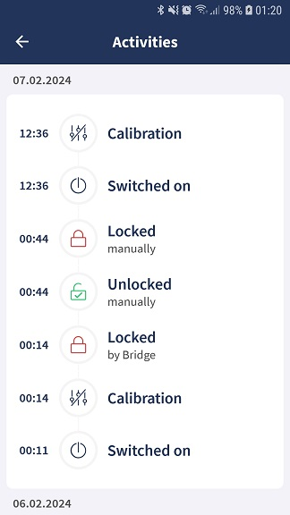

How to get Activity Logs from Tedee Lock
========================================

To send specific commands to get Activity Logs you need to :doc:`establish PTLS session <establish-ptls-session>`.

After you have successfully established the PTLS session you need to turn on BLE indications on :ref:`API commands characteristic <api_commands_characteristic>`.
To receive notifications about existing Activity Logs turn on notifications on :ref:`notifications_characteristic`.

.. note::
    | If Lock has any Activity Logs ready to collect, it will send the notification every 5 seconds. 
    | See :doc:`Has Logs notification for details <../notifications/activity-logs/has-activity-logs>`.

You are probably familiar with the Activity screen on the mobile app:

| The information can be obtained from the Lock directly.
| Bare in mind, the Lock does NOT store the entire history of its activity. Only the most recent records are stored in the internal flash memory, which allows to store about 100 records.
| Once the Mobile App, Bridge or an integrated system receives a package of Activity Logs, the relevant records are removed from the Lock permanetly, making space for new ones.

| Use :doc:`Get Logs command <../commands/activity-logs/get-logs-tlv>` to get Activity Logs records in a binary format called TLV.
| An example data received from Lock may look as shown below:

| Example raw binary data:

.. code-block::

    [0x01,0x01,0x01,0x03,0x01,0x2A,0x04,0x01,0x00,0x05,0x08,0x00,0x00,0x01,0x8D,0xA5,0x11,0x24,0xFE,0x06,0x04,0x00,0x00,0x8B,0xD8,0x07,0x04,0x00,0x00,0x00,0x00,0x02,0x46,0x30,0x44,0x02,0x20,0x1B,0xD6,0x6B,0x8A,0x21,0xEE,0x9C,0x6C,0x28,0x82,0x03,0xC4,0xA5,0xB0,0x2C,0x93,0x45,0x58,0x41,0x53,0x7B,0x56,0x37,0x63,0xB7,0xCF,0xEA,0x7F,0xEA,0xE0,0xEC,0xCC,0x02,0x20,0x42,0x0A,0xA4,0xB5,0x8C,0xF6,0x2C,0x7C,0xA4,0xA0,0x32,0x30,0xC8,0x47,0xDB,0x49,0x4A,0x73,0x8B,0x0C,0x27,0xE7,0x4F,0x40,0x74,0x4F,0x1D,0x98,0xB6,0x3B,0x24,0x25]

| The same example data shown above but parsed into fields with descriptions:

.. code-block::

    Tag ID: 0x01 (Length: 0x01): 01                 //version of logs format: 1
    Tag ID: 0x03 (Length: 0x01): 2A                 //event ID (Event name: PowerOn)
    Tag ID: 0x05 (Length: 0x08): 0000018DA51124FE   //evet datetime - Epoch time in milliseconds (big endian): 1707871380734
    Tag ID: 0x06 (Length: 0x04): 00008BD8           //Device (Lock) ID - (big endian): 35800
    Tag ID: 0x07 (Length: 0x04): 00000000           //User ID - (big endian): 0 - not known for this event
    Tag ID: 0x02 (Length: 0x46): 304402201...       //Digital Signature of the package

| Go to :doc:`Get Logs command <../commands/activity-logs/get-logs-tlv>` to get detailed information.