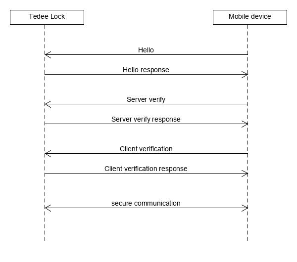

How to establish PTLS session
=============================

As a security library we recommend using `MbedTLS <https://github.com/ARMmbed/mbedtls>`_.

To startup establishing PTLS session you need to:

#. Register connectable device in our `Tedee API <https://tedee-tedee-api-doc.readthedocs-hosted.com/en/latest/endpoints/mobile/register.html>`_ with ECDSA asymmetric public key. 
#. :doc:`Find proper Tedee Lock <find-tedee-lock>`.
#. :doc:`Connect to lock <../ble/basics>`.
#. Turn on notifications on :ref:`ptls_tx_characteristic`.
#. Establish PTLS session via 3 stages writting on characteristic :ref:`ptls_rx_characteristic` and reading from :ref:`ptls_tx_characteristic`:

   #. :doc:`Exchange "Hello" messages <../ptls/hello_handshake>`
   #. :doc:`Server verification <../ptls/server_verification>`
   #. :doc:`Client verification <../ptls/client_verification>`

PTLS session establishement is presented on below communication diagram.

