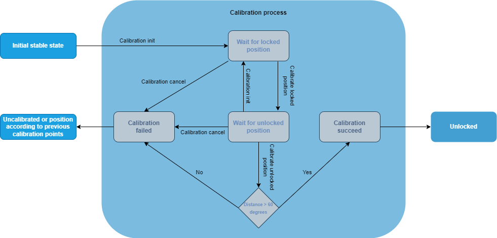

How to calibrate your Tedee lock
================================

To send specific commands to lock about calibration process you need to :doc:`establish PTLS session <establish-ptls-session>`.

After you have successfully established the PTLS session you need to turn on BLE indications on :ref:`API commands characteristic <api_commands_characteristic>`.
To receive notifications from calibration process turn on notifications on :ref:`notifications_characteristic`.

.. note::
    #. Your lock should be mounted on doors before using these endpoints.
    #. Lock should be in stable states to init calibration process.

To properly calibrate locked and unlocked positions for the lock you need to:

| 1. Switch lock into calibration mode via :doc:`Init command <../commands/calibration/calibration-init>`. 
|   Lock will change it's state to calibration for 3 minutes. It's a timeout for whole process. 
|   You will receive :doc:`timeout <../notifications/calibration/calibration-finished>` notification with TIMEOUT param if you do not finish calibration within 3min.
| 2. Rotate the lock manually to locked position and send :doc:`calibrate locked position <../commands/calibration/calibrate-locked>`
| 3. Rotate the lock manually to unlocked position and send :doc:`calibrate unlocked position <../commands/calibration/calibrate-unlocked>`
| 4. Lock will send :doc:`calibration finished <../notifications/calibration/calibration-finished>` notification with succeed param.
| 5. Lock will enter unlocked state.

When you formed command to be send then :doc:`encrypt <../ptls/secured_communication>` and send on :ref:`API commands characteristic <api_commands_characteristic>`.

Each action can be performed only in specific calibration state. Here is the calibration state diagram:

