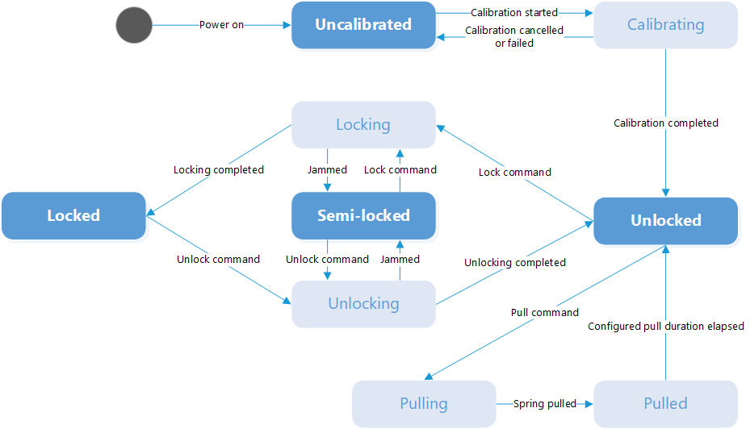

How to operate your Tedee lock
==============================

To send specific commands to lock about locking or unlocking you need to :doc:`establish PTLS session <establish-ptls-session>`.

After you successfully established PTLS session you need to turn on BLE indications on :ref:`API commands characteristic <api_commands_characteristic>`.

.. note::
    Your lock should be calibrated already before using these endpoints.

You can perform following actions on lock:

| 1. Using :doc:`Lock open command <../commands/operations/lock-open>` you are able to unlock your lock. 
| In specific case you are also able to perform pull spring.
| 
| 2. Using :doc:`Lock close command <../commands/operations/lock-close>` you are able to unlock your lock.
| 3. Using :doc:`Pull spring command <../commands/operations/pull-spring>` you are able to pull the spring from unlocked lock.

When you formed command to be send then :doc:`encrypt <../ptls/secured_communication>` and send on :ref:`API commands characteristic <api_commands_characteristic>`.

Each action can be performed only in specific lock states. Here is Lock state diagram:

