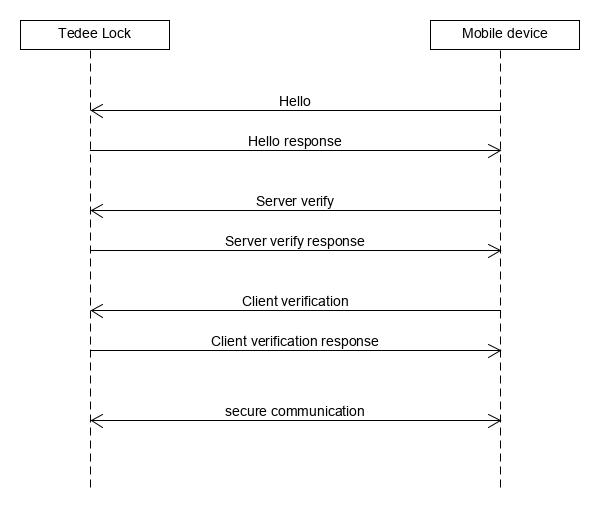

PTLS basics
===========

PTLS session is a simplified and modified version of the TLS 1.3 protocol used for secure communication.
It allows authorizing the communication parties with each other and to fully encrypt the transmitted data.

The system architecture assumes that each User has an individual account and can log in with an email address and the password. 
Each user's access device (e.g. mobile phone) from which the login was made is automatically `registered <https://tedee-tedee-api-doc.readthedocs-hosted.com/en/latest/endpoints/mobile/register.html>`_ in the system. 
When registering, a key pair is generated on the user's access device:

- **Device Private Key** (ECDSA asymmetric key - prime256v1) - The private key of the access device (mobile phone), is stored only in that device and nowhere else. It is used for establishing the PTLS session.
- **Device Public Key** (ECDSA asymmetric key - prime256v1) - The public key of the access device (mobile phone), is stored on the device (on the phone) and also on the backend server. It is used for establishing the PTLS session.

It should be noted that the user can have multiple access devices (phone, tablet, etc.). Each of these public keys is stored separately on the backend server.

Overview
--------

During the session establishing process, **authentication** (checking the identity) and **authorization** (checking rights and privileges) of communicating parties are performed. 
It is assumed that the side initiating the PTLS session is called the "**client**" and the side responding to it is called the "**server**". 
The session can only be initialized by the connected device. 
Please note that due to the naming convention, the connected device is in this case "**client**" and Tedee Lock is "**server**". 
During session establishment, the "client side" sends a permission certificate. 
The permissions contained in the certificate and its signature are verified by the Tedee Lock. 
It is not possible to establish a PTLS session if permissions are not successfully verified or if any session establishment steps failed.
The establishment of a PTLS session requires setup of the `date and time <https://tedee-tedee-api-doc.readthedocs-hosted.com/en/latest/endpoints/datetime/get-signed-time.html>`_ from a trusted source (`Tedee API <https://api.tedee.com/>`_). 
This should be done using the API command (:doc:`SET_SIGNED_DATETIME <../commands/security/set-signed-time>`) after the :ref:`specific error code <ptls-error-codes>` was returned when establishing the session. 

.. _ptls_algorithms:

Algorithms used
---------------

The following algorithms are used for encrypting data transfer and establishing the PTLS session:

#. **SHA256**
#. **ECDH**   - ECC NIST P-256
#. **HMAC**   - SHA256
#. **AEAD** (*Authenticated Encryption with Associated Data*) (AES GCM 128bit)

Steps to establish PTLS session
-------------------------------

There are 4 stages of PTLS session:

#. :doc:`Exchange "Hello" messages <hello_handshake>`
#. :doc:`Server verification <server_verification>`
#. :doc:`Client verification <client_verification>`
#. :doc:`Secured communication <secured_communication>`.

PTLS session establishment is presented in below communication diagram.

For every step should be used two characteristics: :ref:`ptls_tx_characteristic` and :ref:`ptls_rx_characteristic`.

.. _ptls-error-codes:

PTLS error codes
----------------

+----------------------------+-------+-----------------------------------------------------------------------------------------------------------+
| Name                       | Value | Description                                                                                               |
+----------------------------+-------+-----------------------------------------------------------------------------------------------------------+
| ALERT_CODE_OK              | 0x00  | No error                                                                                                  |
+----------------------------+-------+-----------------------------------------------------------------------------------------------------------+
| ALERT_CODE_ERROR           | 0x01  | | Indicates one of many errors that may occur when establishing the session.                              |
|                            |       | | It does not specify its exact location or cause for security reasons.                                   |
+----------------------------+-------+-----------------------------------------------------------------------------------------------------------+
| ALERT_CODE_NO_TRUSTED_TIME | 0x02  | | No trusted date and time.                                                                               |
|                            |       | | Time should be set via API command (:doc:`SET_SIGNED_DATETIME <../commands/security/set-signed-time>`)  |
+----------------------------+-------+-----------------------------------------------------------------------------------------------------------+
| ALERT_CODE_TIMEOUT         | 0x03  | Session has expired due to session timeout (**24h**)                                                      |
+----------------------------+-------+-----------------------------------------------------------------------------------------------------------+
| ALERT_CODE_DISCONNECTED    | 0x04  | Communication side disconnected (Bluetooth connection closed)                                             |
+----------------------------+-------+-----------------------------------------------------------------------------------------------------------+
| ALERT_CODE_INVALID_CERT    | 0x05  | | Invalid certificate.                                                                                    |
|                            |       | | It applies to any problem with the certificate (expired, no permissions, invalid signature, etc.)       |
+----------------------------+-------+-----------------------------------------------------------------------------------------------------------+
| ALERT_CODE_NOT_REGISTERED  | 0x06  | | Indicates the situation where the device is still linked with the account but has been manually reset   |
|                            |       | | to factory defaults (unregistered). In such a case, the device has no keys to establish a PTLS session. |
+----------------------------+-------+-----------------------------------------------------------------------------------------------------------+
